# Manual de Operação — Sistema PCP

> Guia para quem opera o sistema no dia a dia: gestores e administradores que
> cadastram fornecedores, partes/peças e produtos acabados. Não cobre a API
> nem detalhes de implementação — para isso, veja
> [3_ESPECIFICACAO_APIS.md](3_ESPECIFICACAO_APIS.md) e
> [5_GUIA_IMPLEMENTACAO.md](5_GUIA_IMPLEMENTACAO.md).

## Índice

1. [Acesso ao sistema](#1-acesso-ao-sistema)
2. [Navegação geral](#2-navegação-geral)
3. [Painel](#3-painel)
4. [Fornecedores](#4-fornecedores)
5. [Partes e peças](#5-partes-e-peças)
6. [Produtos acabados](#6-produtos-acabados)
7. [Estrutura de produtos (BOM)](#7-estrutura-de-produtos-bom)
8. [Cotações](#8-cotações)
9. [Pedidos de compra](#9-pedidos-de-compra)
10. [Estoque e recebimento](#10-estoque-e-recebimento)
11. [Necessidade de compra e relatórios](#11-necessidade-de-compra-e-relatórios)
12. [Ajuda contextual](#12-ajuda-contextual)
13. [Perguntas frequentes](#13-perguntas-frequentes)

---

## 1. Acesso ao sistema

Abra o sistema no navegador e entre com o usuário e a senha fornecidos pelo
administrador.

- O ícone de olho ao lado do campo Senha mostra o que foi digitado, para
  conferir antes de enviar.
- Se o usuário ou a senha estiverem errados, uma mensagem explica o problema
  logo abaixo do formulário.
- Se a sessão cair por inatividade (o sistema encerra a sessão automaticamente
  depois de um tempo sem uso) ou expirar, o sistema volta para esta tela e
  avisa o motivo. Basta entrar de novo — nada do que já foi salvo se perde.
- Todas as telas, inclusive esta, têm um botão **Ajuda** no canto superior
  direito. Veja a seção [12](#12-ajuda-contextual).

---

## 2. Navegação geral

Depois de entrar, o sistema mostra a moldura padrão de todas as telas
internas: cabeçalho no topo, navegação lateral à esquerda e o conteúdo da
tela atual à direita.

- **Cabeçalho**: nome e perfil de quem está operando, o botão **Ajuda** e o
  botão **Sair**.
- **Navegação lateral**: acesso ao Painel, aos cadastros (Fornecedores,
  Partes e peças, Produtos acabados), à Estrutura de produtos e a Compras
  (Cotações, Pedidos de compra, Necessidade de compra). O item em cinza, com
  "Próxima sprint" (Produção), ainda não foi implementado.
- **Sair**: encerra a sessão imediatamente e volta para o login.

---

## 3. Painel

O Painel é a tela inicial.

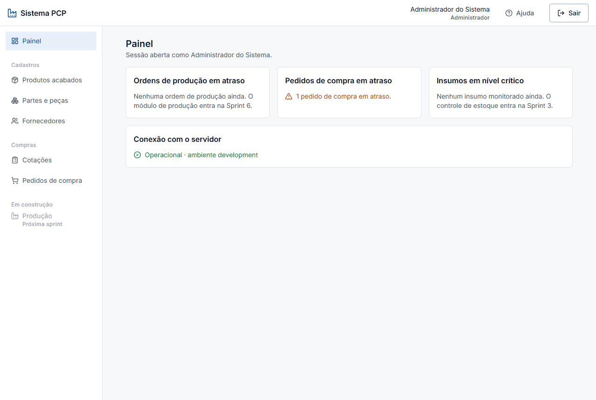

Ele mostra:

- **Ordens de produção em atraso**: o módulo de produção ainda não existe,
  então o cartão só explica quando vai entrar em operação (Sprint 6), em vez
  de mostrar um número inventado.
- **Pedidos de compra em atraso**: indicador real, calculado a partir dos
  pedidos de compra emitidos cuja data de entrega prevista já passou (veja a
  seção [9](#9-pedidos-de-compra)). Vazio quando não há nenhum atraso.
- **Insumos em nível crítico**: também um indicador real — conta quantas
  partes/peças estão em [situação Crítico](#10-estoque-e-recebimento) no
  módulo de Estoque. Vazio quando não há nenhuma peça crítica.

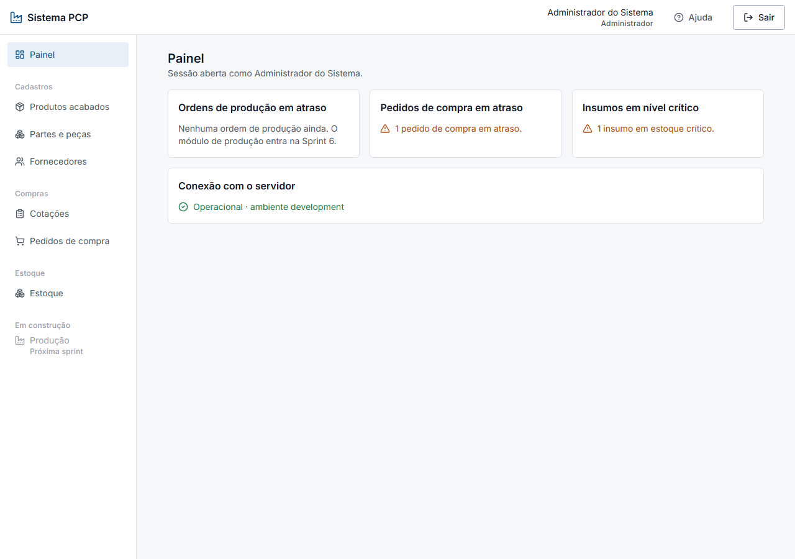

- Um cartão de **Conexão com o servidor**, que avisa se a API está fora do
  ar. Se aparecer "Servidor indisponível", nenhuma tela de cadastro vai
  funcionar até a conexão voltar — não é necessário reportar como bug, espere
  a reconexão automática.

---

## 4. Fornecedores

Tela de cadastro de quem abastece as partes e peças usadas na produção.

### 4.1 Buscar, filtrar e ordenar

- O campo **Buscar por razão social, CNPJ ou contato** filtra a lista
  conforme você digita (não precisa apertar Enter).
- O seletor **Situação** troca entre Ativos (padrão), Inativos e Todos.
- Clique no cabeçalho de **Razão social**, **CNPJ** ou **Lead time** para
  ordenar a lista por essa coluna; clique de novo para inverter a ordem.

### 4.2 Cadastrar um fornecedor

Clique em **Novo fornecedor**.

Campos marcados com `*` são obrigatórios: **Razão social**, **CNPJ** e
**Lead time médio**. O CNPJ pode ser digitado com ou sem pontuação — o
sistema aceita os dois formatos e exibe sempre pontuado na lista. Os demais
campos (contato, endereço, condição de pagamento) são opcionais.

Se o CNPJ já pertencer a outro fornecedor cadastrado (mesmo que ele esteja
inativo), o sistema recusa o cadastro e explica o motivo no topo do
formulário, sem fechar a janela — corrija o CNPJ e tente de novo.

### 4.3 Editar e reativar

Clique em **Editar** na linha do fornecedor.

O formulário abre preenchido com os dados atuais. Ao editar (só ao editar,
não ao cadastrar um novo) aparece também o campo **Situação** — é a única
forma de reativar um fornecedor que foi inativado antes: mude a situação
para "Ativo" e salve.

### 4.4 Inativar

Clique em **Inativar** na linha do fornecedor. O sistema pergunta antes de
agir:

Inativar **preserva o histórico** — o registro não é apagado, apenas some da
lista de fornecedores ativos e das listas de seleção usadas em outras telas
(por exemplo, o "Fornecedor padrão" de uma peça). Para ver fornecedores
inativos, mude o filtro Situação para "Inativos" ou "Todos".

---

## 5. Partes e peças

Tela de cadastro de componentes comprados e consumidos na montagem.

Funciona como a tela de Fornecedores (busca, filtro de situação, ordenação
por coluna, editar e inativar/reativar — veja a seção [4](#4-fornecedores)
para o passo a passo). O que muda é o formulário de cadastro:

- **Código**, **Unidade** e **Descrição** são obrigatórios.
- **Estoque mínimo** e **Estoque máximo** definem a faixa de reposição usada
  pelo módulo de Estoque (seção [10](#10-estoque-e-recebimento)) para decidir
  quando repor.
- **Lead time de compra** é o prazo esperado, em dias, entre pedir e receber
  a peça do fornecedor.
- **Fornecedor padrão** é opcional — só lista fornecedores ativos, e é usado
  pela tela de [Necessidade de compra](#11-necessidade-de-compra-e-relatórios)
  para agrupar sugestões de compra.

---

## 6. Produtos acabados

Tela de cadastro do que é vendido ao cliente.

Também segue o mesmo padrão de busca, filtro, ordenação, editar e
inativar/reativar da seção [4](#4-fornecedores). O formulário de cadastro:

- **Código**, **Unidade**, **Descrição** e **Preço de venda** são
  obrigatórios.
- **Lead time de produção** é o prazo esperado, em dias, para produzir uma
  unidade — informação que o módulo de produção (Sprint 6) vai usar para
  planejar ordens.

---

## 7. Estrutura de produtos (BOM)

Tela que define do que é feito cada produto acabado: a lista de partes/peças
e a quantidade de cada uma necessárias para montar **1 unidade**. É a "receita"
que o módulo de produção (Sprint 6) vai seguir para calcular o consumo de
insumos de uma ordem de produção.

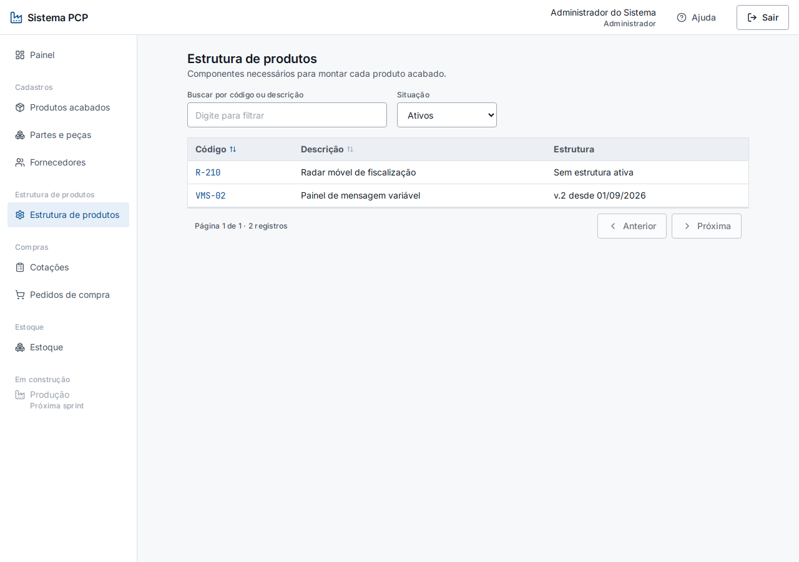

A lista mostra todos os produtos acabados; a coluna **Estrutura** indica
"Sem estrutura ativa" para quem ainda não tem BOM cadastrada, ou a versão e a
data de vigência de quem já tem (por exemplo, "v.2 desde 01/09/2026").

### 7.1 Criar a primeira versão

Clique no código de um produto sem estrutura ativa para abrir o detalhe, e em
**Criar estrutura**.

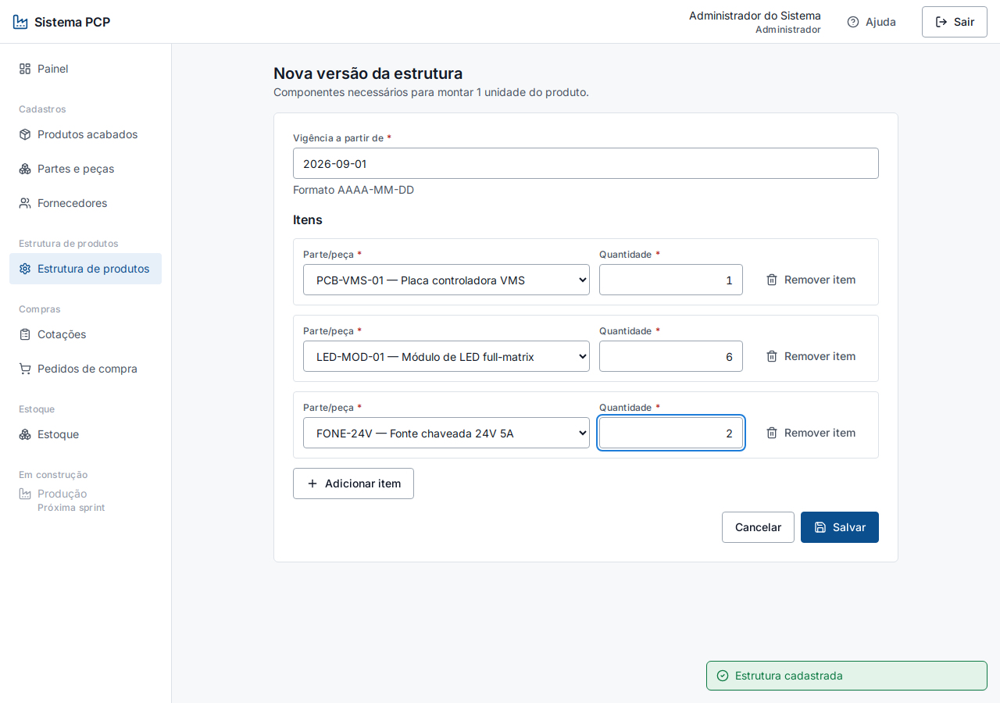

**Vigência a partir de** e ao menos **um item** (peça e quantidade) são
obrigatórios. Use **Adicionar item** para incluir mais peças. Ao salvar, você
volta para o detalhe do produto, já mostrando a versão recém-criada.

### 7.2 Versionar (nova versão)

Uma estrutura de produto **nunca é editada nem apagada** — RF1.3 exige
preservar o que cada ordem de produção passada realmente usou. Para mudar a
composição (trocar uma peça, ajustar uma quantidade), use **Nova versão**,
disponível no detalhe do produto assim que ele já tem uma estrutura ativa.

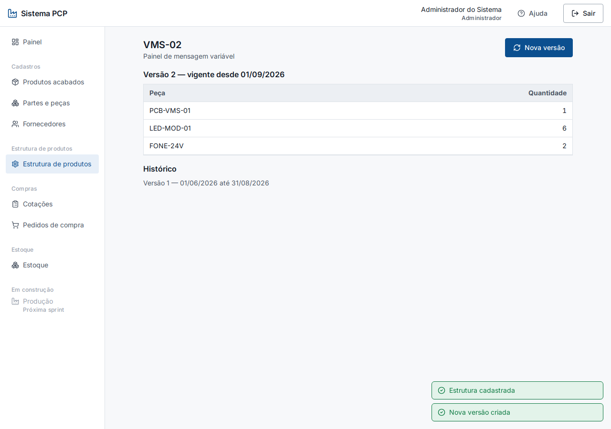

O formulário de nova versão é igual ao de criação, mas exige uma
**vigência posterior** à da versão atual. Ao salvar, a versão anterior é
automaticamente encerrada (ganha uma data de fim de vigência) e cai para a
seção **Histórico**, visível abaixo da versão ativa — nada se perde, só deixa
de valer a partir daquela data.

Só existe **uma versão ativa por produto de cada vez** — por isso o botão
"Criar estrutura" só aparece para produtos que ainda não têm nenhuma; a partir
da primeira versão, o caminho é sempre "Nova versão".

---

## 8. Cotações

Tela de pedido de preço a um fornecedor, antes de qualquer compromisso de
compra.

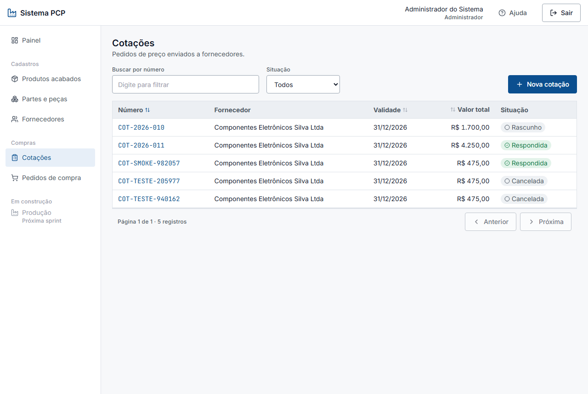

### 8.1 Buscar, filtrar e ordenar

Segue o mesmo padrão das telas de cadastro (seção [4.1](#41-buscar-filtrar-e-ordenar)),
trocando "Situação" por status da cotação: Rascunho, Enviada, Respondida ou
Cancelada.

### 8.2 Cadastrar uma cotação

Clique em **Nova cotação**. Diferente dos cadastros, esta tela abre uma
página inteira, não uma janela — uma cotação tem uma lista de itens que não
cabe bem num espaço pequeno.

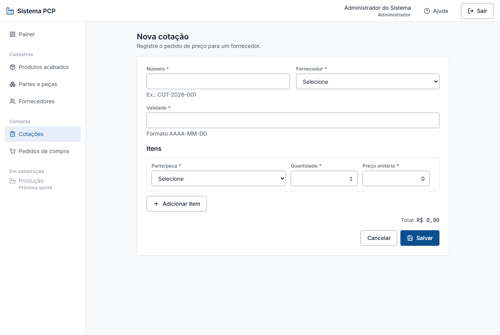

**Número**, **Fornecedor**, **Validade** e ao menos **um item** (peça,
quantidade e preço unitário) são obrigatórios. Use **Adicionar item** para
incluir mais peças; o total é recalculado a cada alteração. Ao salvar, você
vai para a tela de detalhe da cotação recém-criada.

Uma cotação também pode chegar já parcialmente preenchida, vinda da tela de
[Necessidade de compra](#11-necessidade-de-compra-e-relatórios) — nesse caso,
fornecedor e itens (peça e quantidade sugerida) já vêm prontos, faltando só o
preço negociado.

### 8.3 O ciclo de vida de uma cotação

A cotação nasce em **Rascunho** e segue uma trilha de três etapas, mostrada
na tela de detalhe:

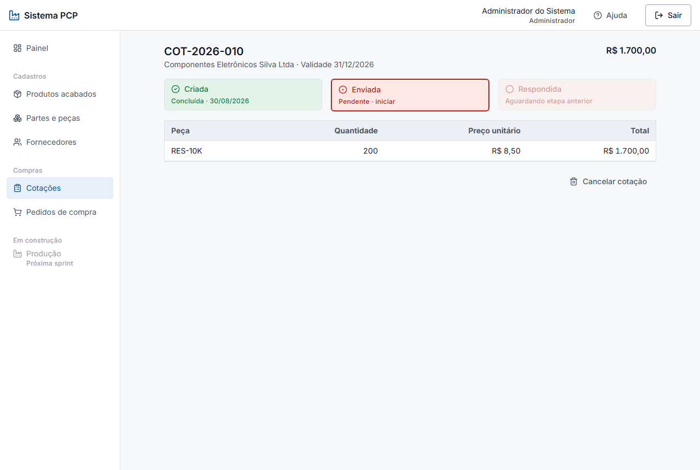

- **Criada** — sempre concluída, é o momento do cadastro.
- **Enviada** — clique na etapa para confirmar que a cotação foi encaminhada
  ao fornecedor. Muda o status para Enviada.
- **Respondida** — clique na etapa para registrar o preço que o fornecedor
  respondeu, item por item, e a data da resposta. O valor total é
  recalculado com os preços negociados.

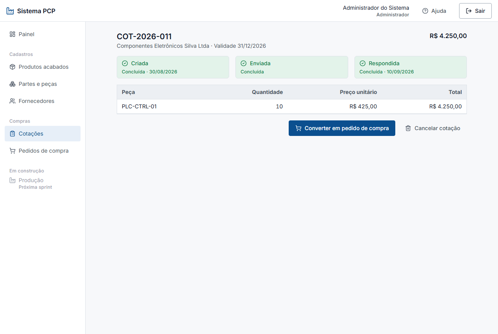

Com a cotação **Respondida**, aparece o botão **Converter em pedido de
compra**: informe o número do novo PC, a data de entrega prevista e a
condição de pagamento, e o sistema cria um pedido de compra com o
fornecedor, as peças e os **preços já negociados** — sem digitar tudo de
novo. Veja a seção [9](#9-pedidos-de-compra).

**Cancelar cotação** fica disponível em qualquer ponto antes do
cancelamento; preserva o histórico e substitui a trilha por um aviso — uma
cotação cancelada não volta a nenhum status anterior.

---

## 9. Pedidos de compra

Tela do pedido de compra propriamente dito — o compromisso formal com o
fornecedor.

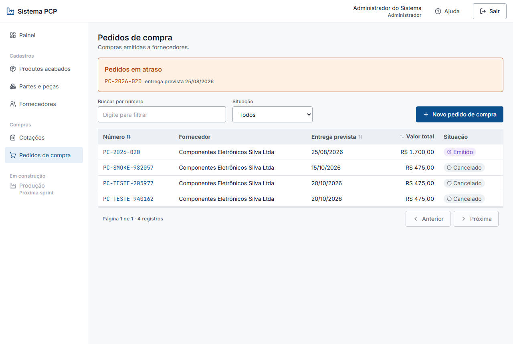

Segue o mesmo padrão de busca, filtro por status e ordenação da tela de
Cotações. Quando existe algum pedido com a entrega vencida, um bloco
**Pedidos em atraso** aparece no topo da lista (é o mesmo indicador do
Painel — veja a seção [3](#3-painel)). O botão **Exportar CSV** baixa a
lista completa de pedidos, sem filtro — veja a seção
[11](#11-necessidade-de-compra-e-relatórios).

### 9.1 Cadastrar um pedido de compra

Clique em **Novo pedido de compra**.

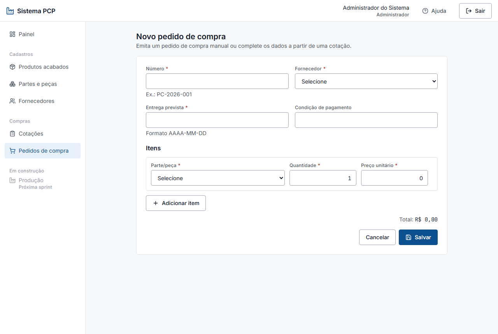

Assim como a cotação, é uma página inteira com uma lista de itens.
**Número**, **Fornecedor**, **Entrega prevista** e ao menos um item são
obrigatórios; **Condição de pagamento** é opcional. Um pedido também pode
nascer de uma cotação respondida, pelo botão "Converter em pedido de
compra" da seção [8.3](#83-o-ciclo-de-vida-de-uma-cotação) — nesse caso, o
pedido já sai vinculado à cotação de origem.

### 9.2 O ciclo de vida de um pedido de compra

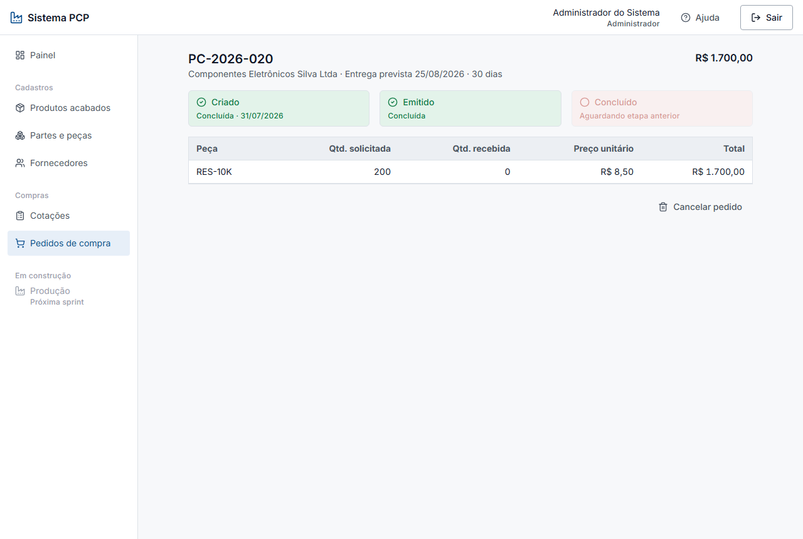

A trilha aqui tem três etapas: **Criado** (sempre concluída), **Emitido**
(clique para confirmar o envio ao fornecedor) e **Concluído** — esta última
fica acionável assim que o pedido é emitido e é onde se registra o
recebimento da mercadoria (seção [10.3](#103-registrar-o-recebimento-de-um-pedido-de-compra)).
Se o pedido veio de uma cotação, um link **Ver cotação de origem** aparece
abaixo do número.

**Cancelar pedido** fica disponível enquanto o pedido não estiver
Concluído nem já Cancelado; preserva o histórico.

---

## 10. Estoque e recebimento

Tela que mostra o saldo de cada parte/peça em armazém e permite corrigir esse
saldo manualmente. É também o destino do recebimento de mercadoria: cada
pedido de compra emitido dá entrada em estoque conforme o fornecedor entrega.

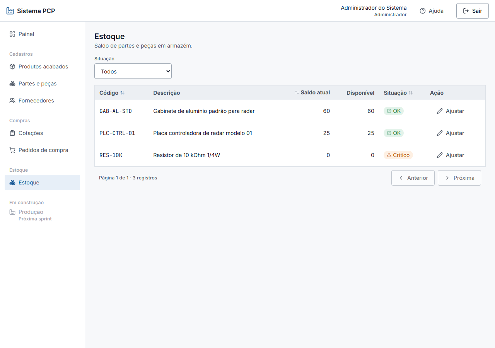

O botão **Exportar CSV** baixa o saldo completo, sem filtro — veja a seção
[11](#11-necessidade-de-compra-e-relatórios).

### 10.1 Consultar o saldo

- O seletor **Situação** filtra por OK, Crítico ou Bloqueado (o padrão mostra
  todos).
- Clique no cabeçalho de **Código** ou **Saldo atual** para ordenar por essa
  coluna; clique de novo para inverter a ordem.
- **Disponível** é o saldo que já desconta o que estiver reservado para uma
  ordem de produção — a reserva por OP só chega no módulo de produção
  (Sprint 6), então hoje é sempre igual ao Saldo atual.
- **Situação** resume o saldo num selo: **Crítico** quando o saldo está no
  ou abaixo do estoque mínimo cadastrado na peça (seção [5](#5-partes-e-peças)),
  **OK** quando está acima, ou **Bloqueado**. Uma peça recém-cadastrada nasce
  com saldo zero e por isso sempre começa em Crítico, mesmo que o estoque
  mínimo cadastrado seja zero (veja a seção [13](#13-perguntas-frequentes)).

### 10.2 Ajustar o saldo manualmente

Clique em **Ajustar** na linha da peça.

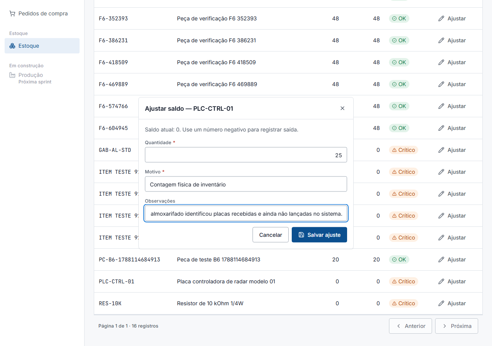

**Quantidade** e **Motivo** são obrigatórios; **Observações** é opcional. Use
um número positivo para registrar entrada (por exemplo, uma contagem de
inventário que encontrou mais peças do que o sistema registrava) e um número
negativo para registrar saída (perda, avaria, consumo não rastreado). O
sistema recusa um ajuste negativo maior que o saldo disponível — a mensagem
de erro aparece no topo do formulário e o modal continua aberto para
correção. Todo ajuste fica registrado no histórico de movimentação de
estoque, com o motivo informado.

### 10.3 Registrar o recebimento de um pedido de compra

Quando um pedido de compra é emitido (seção [9.2](#92-o-ciclo-de-vida-de-um-pedido-de-compra)),
ele já nasce em **Aguardando Entrega** — a etapa **Concluído** da trilha fica
acionável desde já, esperando a mercadoria chegar.

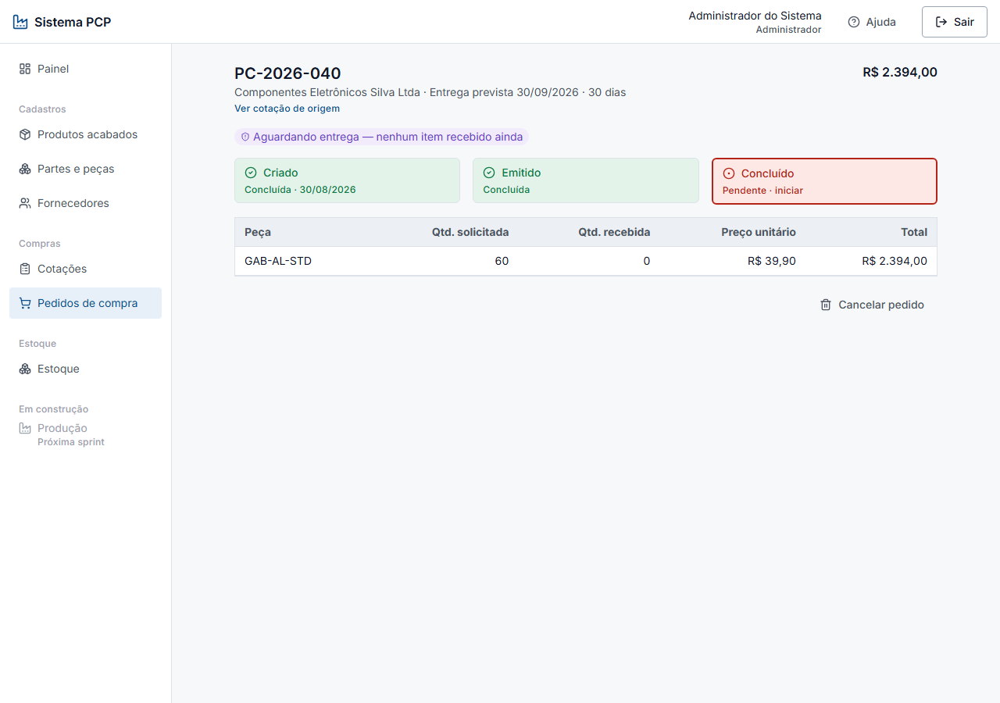

Clique na etapa **Concluído** para abrir o registro de recebimento.

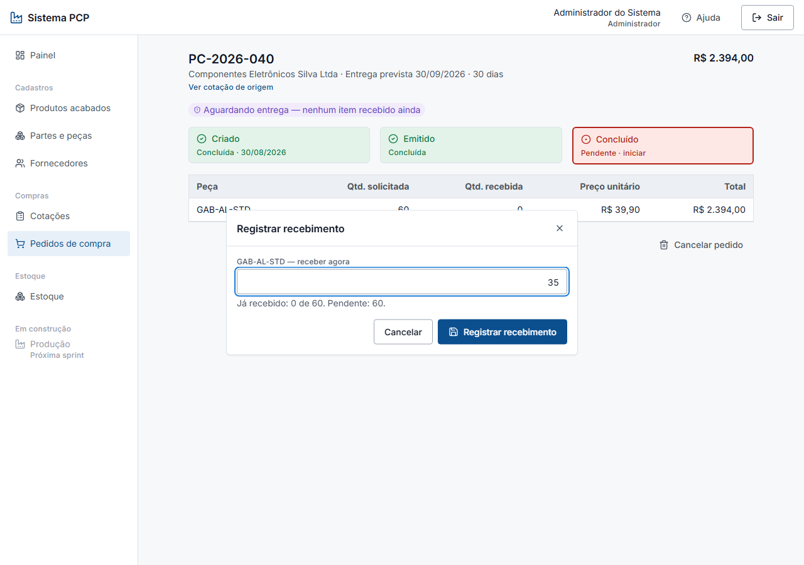

Cada item do pedido tem um campo **— receber agora**, com o total já
recebido e o que ainda está pendente logo abaixo. A partir daí:

- **Receber parcialmente**: informe menos do que o pendente (no exemplo
  acima, o fornecedor entregou 35 dos 60 gabinetes pedidos). O pedido muda
  para **Recebido Parcial** e a etapa Concluído continua acionável — o
  restante pode ser recebido depois, numa nova visita ao modal.
- **Receber o total**: repita a operação informando o que ainda está
  pendente (os 25 restantes, no mesmo exemplo). Quando não sobra pendente em
  nenhum item, o pedido muda para **Concluído** e a trilha se fecha.

Cada recebimento registrado dá entrada automaticamente no saldo de estoque da
peça (seção [10.1](#101-consultar-o-saldo)) — não é preciso lançar um ajuste
manual para isso.

Como **Aguardando Entrega** e **Recebido Parcial** parecem iguais na trilha
(mesma cor, mesmo "Pendente · iniciar"), um selo acima da trilha mostra qual
dos dois é — "Aguardando entrega — nenhum item recebido ainda" ou "Recebido
parcial" — sem precisar abrir o modal só para checar.

---

## 11. Necessidade de compra e relatórios

Tela que cruza o estoque mínimo de cada peça com o saldo atual e sugere o que
precisa ser comprado — a base do planejamento de compras, antes de existir
Ordem de Produção (a fórmula completa, que também considera OPs pendentes,
só entra no módulo de Produção).

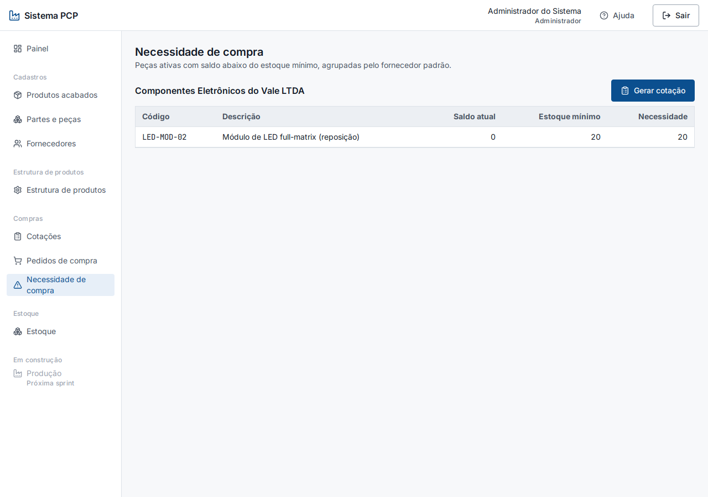

- Só aparecem peças **ativas** com saldo **abaixo** do estoque mínimo
  cadastrado (seção [5](#5-partes-e-peças)).
- **Necessidade** é a quantidade sugerida: estoque mínimo menos o saldo
  atual.
- A lista é agrupada pelo **fornecedor padrão** de cada peça. Peças sem
  fornecedor padrão aparecem à parte, sem a opção de gerar cotação — cadastre
  um fornecedor padrão na peça primeiro (seção [5](#5-partes-e-peças)).

### 11.1 Gerar uma cotação a partir da necessidade

Clique em **Gerar cotação** no grupo de um fornecedor.

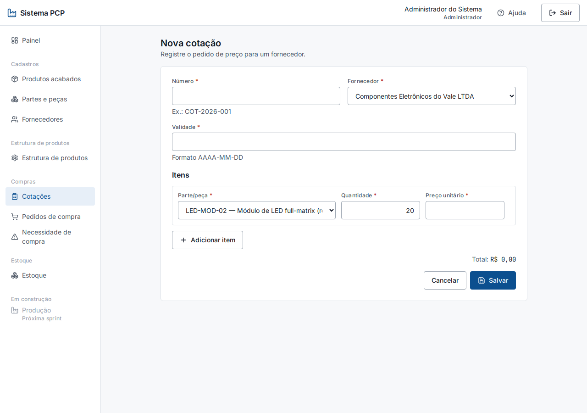

O sistema abre o formulário de [Nova cotação](#82-cadastrar-uma-cotação) já
com o fornecedor selecionado e um item por peça, com a quantidade sugerida —
falta só **Número**, **Validade** e o **preço unitário** de cada item (o
preço é exatamente o que a cotação existe para descobrir, então nunca vem
preenchido). Se algum item não puder ser pré-preenchido (por exemplo, um
fornecedor que foi inativado entre a lista carregar e o clique), um aviso
aparece pedindo para conferir o formulário antes de salvar.

### 11.2 Exportar relatórios em CSV

As telas de [Estoque](#10-estoque-e-recebimento) e
[Pedidos de compra](#9-pedidos-de-compra) têm um botão **Exportar CSV** que
baixa a lista completa (sem filtro, sem paginação) num arquivo pronto para
abrir no Excel. Só CSV por enquanto — PDF pode vir depois, se for pedido.

---

## 12. Ajuda contextual

Toda tela do sistema, inclusive o login, tem um botão **Ajuda** no
cabeçalho. Ele abre uma janela com um lembrete rápido do que dá para fazer
**naquela tela especificamente** — não é o manual inteiro, é a dica do
momento.

Use a Ajuda quando tiver uma dúvida pontual durante a operação; volte a este
manual quando precisar do passo a passo completo ou de contexto sobre como as
telas se relacionam.

---

## 13. Perguntas frequentes

**Inativei um cadastro por engano. Como desfaço?**
Mude o filtro Situação para "Inativos" ou "Todos", clique em Editar no
registro e mude a Situação de volta para "Ativo".

**Cadastrei um fornecedor e ele não some da tela de Fornecedores, mas some da
lista de "Fornecedor padrão" ao cadastrar uma peça — por quê?**
Provavelmente ele foi inativado. Fornecedores inativos continuam na tela de
Fornecedores (filtre por "Inativos" ou "Todos" para vê-los), mas não aparecem
mais como opção para novos vínculos, como o fornecedor padrão de uma peça.

**Por que o sistema recusou o CNPJ que eu digitei?**
Duas causas comuns: o CNPJ não é válido (dígito verificador não confere), ou
já existe um fornecedor cadastrado com esse CNPJ — mesmo que ele esteja
inativo. A mensagem no topo do formulário diz qual dos dois casos é.

**A lista está vazia mas eu sei que existem registros.**
Confira o filtro Situação: o padrão é "Ativos". Se o registro que você
procura foi inativado, mude o filtro para "Inativos" ou "Todos".

**O sistema me devolveu para o login sozinho.**
A sessão expira depois de um tempo de inatividade, por segurança. Entre de
novo — nenhum dado é perdido.

**Não consigo editar uma cotação ou um pedido de compra depois de enviado.**
Por enquanto não há edição livre depois do Rascunho — o fluxo passa por
"Registrar resposta" (cotação) ou segue até a emissão (pedido). Se os dados
estiverem errados, cancele e cadastre de novo.

**Converti uma cotação em pedido de compra, mas o preço não é o que eu
esperava.**
O preço do pedido é sempre o preço **negociado na cotação** (o que foi
registrado em "Registrar resposta"), nunca um novo valor digitado na
conversão — isso evita que o pedido saia com um preço diferente do que foi
combinado com o fornecedor.

**Cadastrei uma peça agora mesmo e ela já aparece em situação Crítica na
tela de Estoque — é um bug?**
Não. Toda peça nasce com saldo zero, porque ainda não houve nenhuma entrada.
A regra de classificação (seção [10.1](#101-consultar-o-saldo)) considera
crítico todo saldo **menor ou igual** ao estoque mínimo cadastrado, e isso
vale mesmo quando o mínimo é zero (zero é menor ou igual a zero). Registre um
ajuste de entrada (seção [10.2](#102-ajustar-o-saldo-manualmente)) ou receba um
pedido de compra (seção [10.3](#103-registrar-o-recebimento-de-um-pedido-de-compra))
para a peça sair dessa situação.

**Por que não dá para editar uma estrutura de produto existente?**
Por design (RF1.3): uma BOM não pode ser deletada nem editada, só
**versionada**. Isso preserva exatamente o que cada ordem de produção
passada consumiu — se fosse possível editar a versão 1 depois que ela já foi
usada para produzir, o histórico de produção ficaria mentindo sobre o que
realmente foi montado. Para mudar a composição, use "Nova versão" (seção
[7.2](#72-versionar-nova-versão)) a partir de uma data de vigência futura.

**Uma peça que eu sei que está crítica não aparece em Necessidade de
compra.**
Duas causas possíveis: o saldo está **exatamente igual** ao estoque mínimo
(a tela de Estoque considera isso Crítico, mas a necessidade de compra exige
saldo **abaixo** do mínimo — sugerir comprar zero unidades não ajudaria); ou
a peça foi inativada (a necessidade de compra só considera peças ativas).

---

**Última atualização**: Agosto 2026 · Fase 2.4 (necessidade de compra e relatórios).
