# Manual de Operação — Sistema PCP

> Guia para quem opera o sistema no dia a dia: gestores e administradores que
> cadastram fornecedores, partes/peças e produtos acabados. Não cobre a API
> nem detalhes de implementação — para isso, veja
> [3_ESPECIFICACAO_APIS.md](3_ESPECIFICACAO_APIS.md) e
> [5_GUIA_IMPLEMENTACAO.md](5_GUIA_IMPLEMENTACAO.md).

## Índice

1. [Acesso ao sistema](#1-acesso-ao-sistema)
2. [Navegação geral](#2-navegação-geral)
3. [Painel](#3-painel)
4. [Fornecedores](#4-fornecedores)
5. [Partes e peças](#5-partes-e-peças)
6. [Produtos acabados](#6-produtos-acabados)
7. [Ajuda contextual](#7-ajuda-contextual)
8. [Perguntas frequentes](#8-perguntas-frequentes)

---

## 1. Acesso ao sistema

Abra o sistema no navegador e entre com o usuário e a senha fornecidos pelo
administrador.

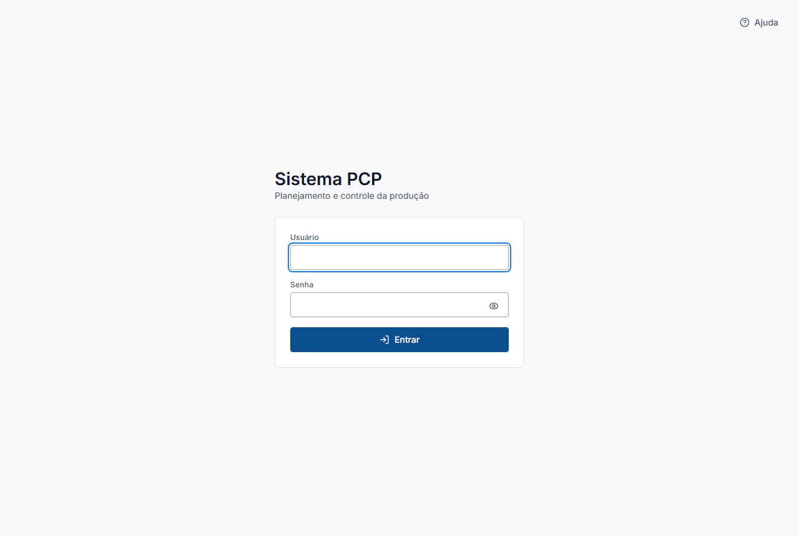

- O ícone de olho ao lado do campo Senha mostra o que foi digitado, para
  conferir antes de enviar.
- Se o usuário ou a senha estiverem errados, uma mensagem explica o problema
  logo abaixo do formulário.
- Se a sessão cair por inatividade (o sistema encerra a sessão automaticamente
  depois de um tempo sem uso) ou expirar, o sistema volta para esta tela e
  avisa o motivo. Basta entrar de novo — nada do que já foi salvo se perde.
- Todas as telas, inclusive esta, têm um botão **Ajuda** no canto superior
  direito. Veja a seção [7](#7-ajuda-contextual).

---

## 2. Navegação geral

Depois de entrar, o sistema mostra a moldura padrão de todas as telas
internas: cabeçalho no topo, navegação lateral à esquerda e o conteúdo da
tela atual à direita.

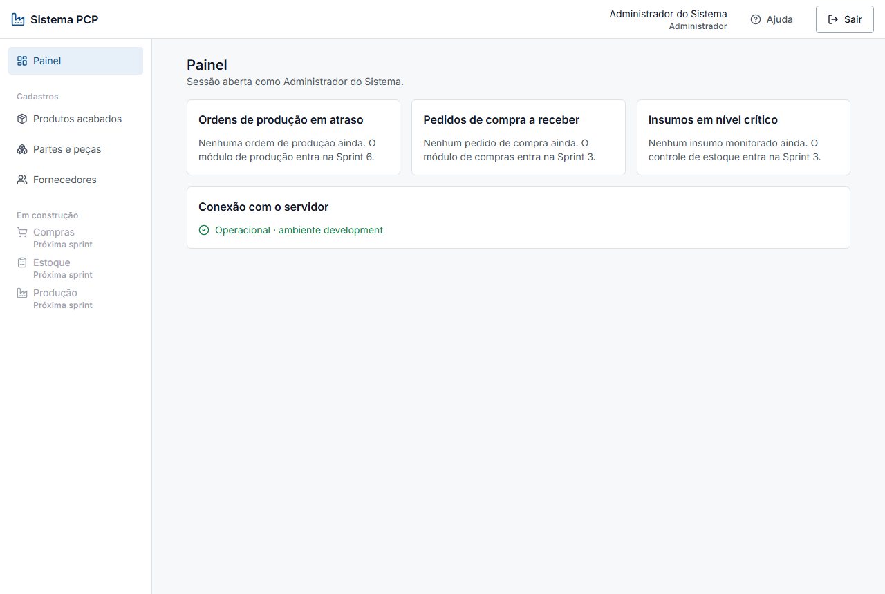

- **Cabeçalho**: nome e perfil de quem está operando, o botão **Ajuda** e o
  botão **Sair**.
- **Navegação lateral**: acesso ao Painel e aos cadastros (Fornecedores,
  Partes e peças, Produtos acabados). Os itens em cinza, com "Próxima
  sprint" (Compras, Estoque, Produção), ainda não foram implementados.
- **Sair**: encerra a sessão imediatamente e volta para o login.

---

## 3. Painel

O Painel é a tela inicial. Ele mostra:

- Três indicadores do módulo de PCP (ordens de produção em atraso, pedidos de
  compra a receber, insumos em nível crítico). Enquanto os módulos
  correspondentes não entrarem em operação, cada cartão explica quando isso
  vai acontecer, em vez de mostrar um número inventado.
- Um cartão de **Conexão com o servidor**, que avisa se a API está fora do
  ar. Se aparecer "Servidor indisponível", nenhuma tela de cadastro vai
  funcionar até a conexão voltar — não é necessário reportar como bug, espere
  a reconexão automática.

---

## 4. Fornecedores

Tela de cadastro de quem abastece as partes e peças usadas na produção.

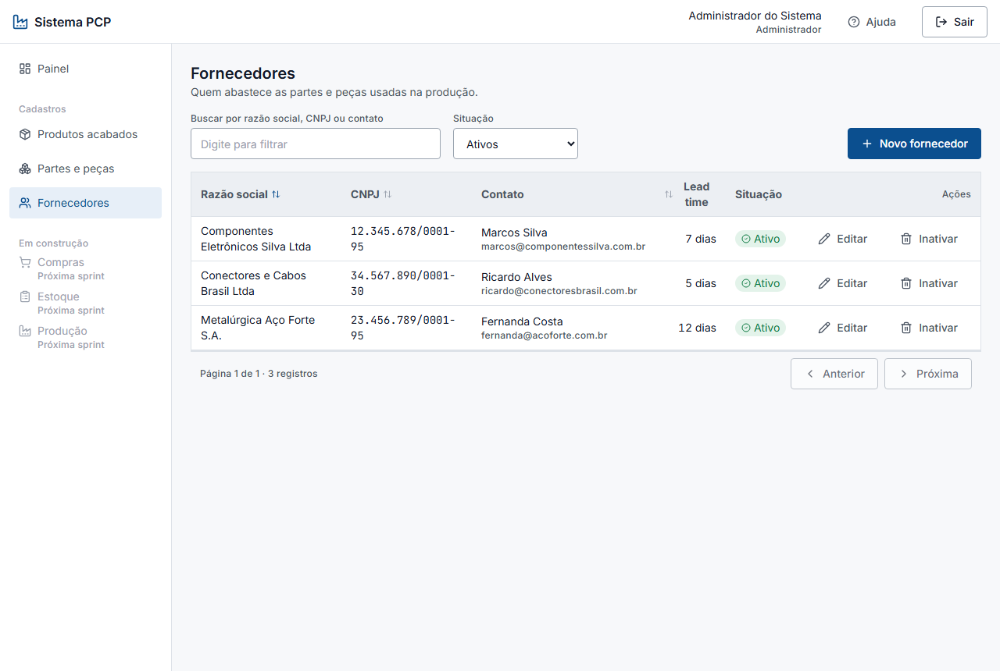

### 4.1 Buscar, filtrar e ordenar

- O campo **Buscar por razão social, CNPJ ou contato** filtra a lista
  conforme você digita (não precisa apertar Enter).
- O seletor **Situação** troca entre Ativos (padrão), Inativos e Todos.
- Clique no cabeçalho de **Razão social**, **CNPJ** ou **Lead time** para
  ordenar a lista por essa coluna; clique de novo para inverter a ordem.

### 4.2 Cadastrar um fornecedor

Clique em **Novo fornecedor**.

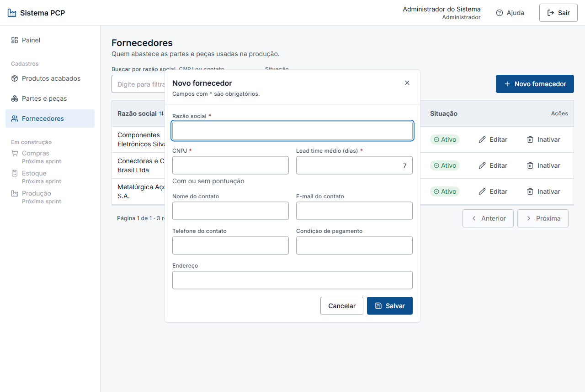

Campos marcados com `*` são obrigatórios: **Razão social**, **CNPJ** e
**Lead time médio**. O CNPJ pode ser digitado com ou sem pontuação — o
sistema aceita os dois formatos e exibe sempre pontuado na lista. Os demais
campos (contato, endereço, condição de pagamento) são opcionais.

Se o CNPJ já pertencer a outro fornecedor cadastrado (mesmo que ele esteja
inativo), o sistema recusa o cadastro e explica o motivo no topo do
formulário, sem fechar a janela — corrija o CNPJ e tente de novo.

### 4.3 Editar e reativar

Clique em **Editar** na linha do fornecedor.

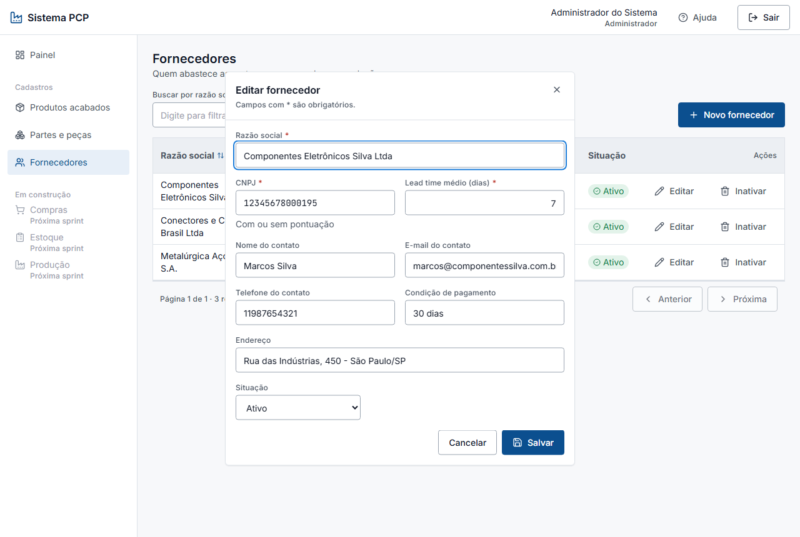

O formulário abre preenchido com os dados atuais. Ao editar (só ao editar,
não ao cadastrar um novo) aparece também o campo **Situação** — é a única
forma de reativar um fornecedor que foi inativado antes: mude a situação
para "Ativo" e salve.

### 4.4 Inativar

Clique em **Inativar** na linha do fornecedor. O sistema pergunta antes de
agir:

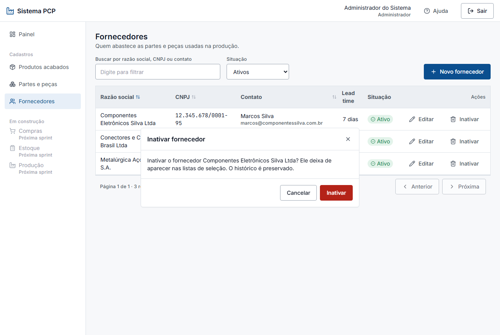

Inativar **preserva o histórico** — o registro não é apagado, apenas some da
lista de fornecedores ativos e das listas de seleção usadas em outras telas
(por exemplo, o "Fornecedor padrão" de uma peça). Para ver fornecedores
inativos, mude o filtro Situação para "Inativos" ou "Todos".

---

## 5. Partes e peças

Tela de cadastro de componentes comprados e consumidos na montagem.

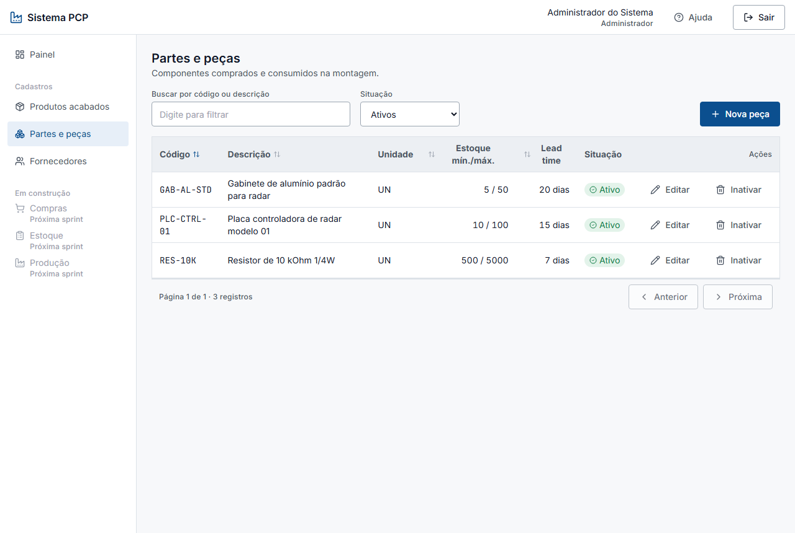

Funciona como a tela de Fornecedores (busca, filtro de situação, ordenação
por coluna, editar e inativar/reativar — veja a seção [4](#4-fornecedores)
para o passo a passo). O que muda é o formulário de cadastro:

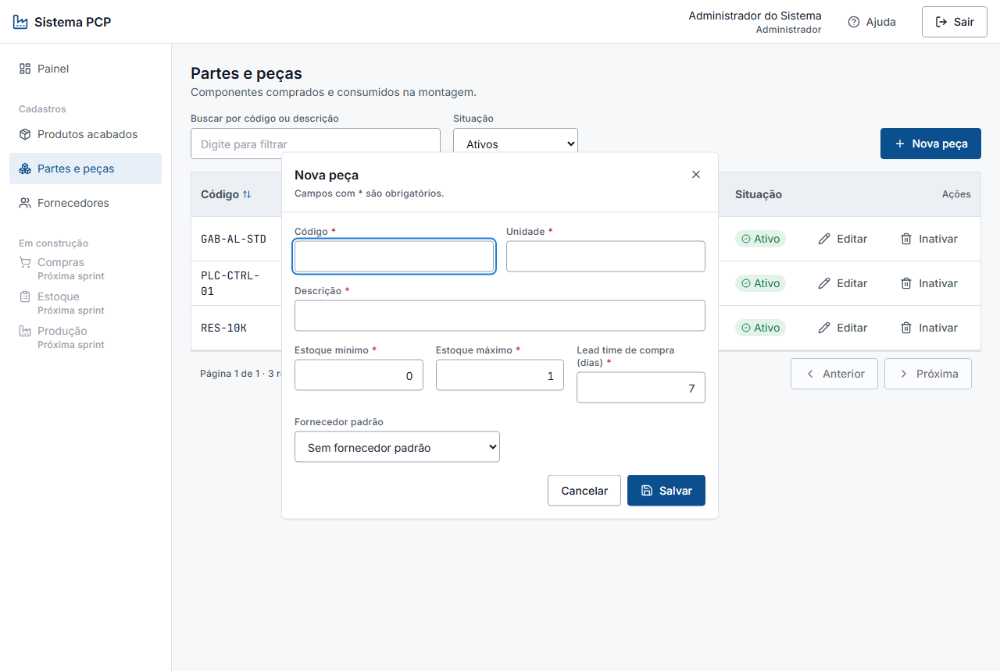

- **Código**, **Unidade** e **Descrição** são obrigatórios.
- **Estoque mínimo** e **Estoque máximo** definem a faixa de reposição usada
  pelo módulo de estoque (Sprint 3) para decidir quando repor.
- **Lead time de compra** é o prazo esperado, em dias, entre pedir e receber
  a peça do fornecedor.
- **Fornecedor padrão** é opcional — só lista fornecedores ativos.

---

## 6. Produtos acabados

Tela de cadastro do que é vendido ao cliente.

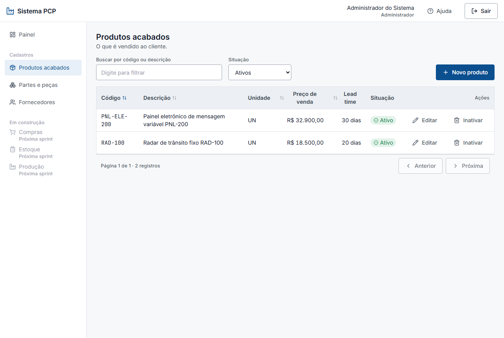

Também segue o mesmo padrão de busca, filtro, ordenação, editar e
inativar/reativar da seção [4](#4-fornecedores). O formulário de cadastro:

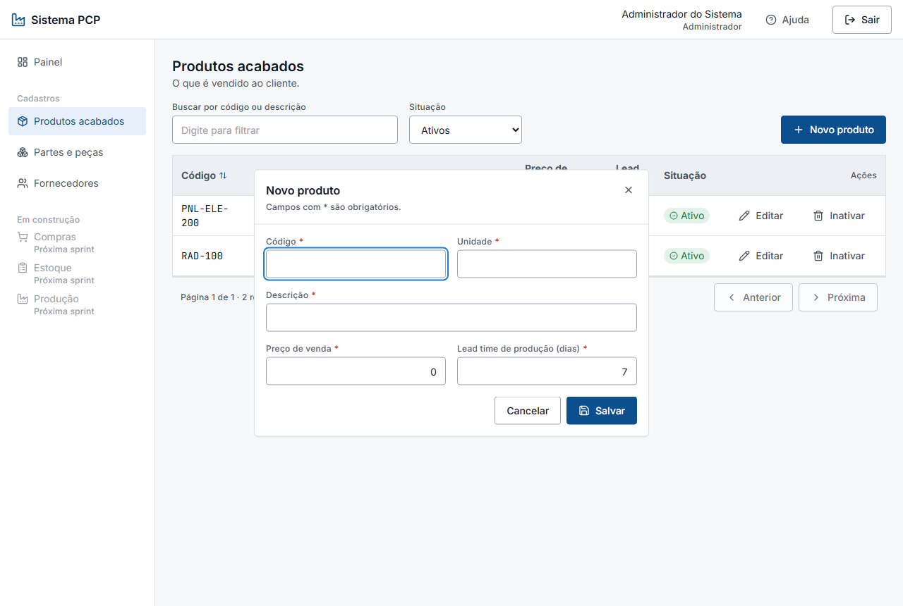

- **Código**, **Unidade**, **Descrição** e **Preço de venda** são
  obrigatórios.
- **Lead time de produção** é o prazo esperado, em dias, para produzir uma
  unidade — informação que o módulo de produção (Sprint 6) vai usar para
  planejar ordens.

---

## 7. Ajuda contextual

Toda tela do sistema, inclusive o login, tem um botão **Ajuda** no
cabeçalho. Ele abre uma janela com um lembrete rápido do que dá para fazer
**naquela tela especificamente** — não é o manual inteiro, é a dica do
momento.

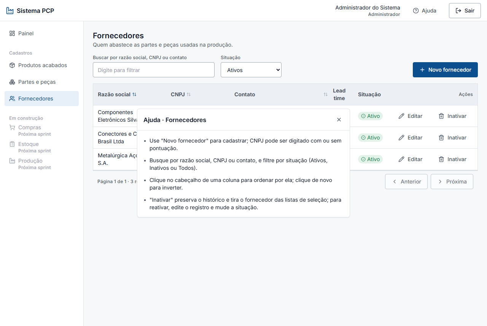

Use a Ajuda quando tiver uma dúvida pontual durante a operação; volte a este
manual quando precisar do passo a passo completo ou de contexto sobre como as
telas se relacionam.

---

## 8. Perguntas frequentes

**Inativei um cadastro por engano. Como desfaço?**
Mude o filtro Situação para "Inativos" ou "Todos", clique em Editar no
registro e mude a Situação de volta para "Ativo".

**Cadastrei um fornecedor e ele não some da tela de Fornecedores, mas some da
lista de "Fornecedor padrão" ao cadastrar uma peça — por quê?**
Provavelmente ele foi inativado. Fornecedores inativos continuam na tela de
Fornecedores (filtre por "Inativos" ou "Todos" para vê-los), mas não aparecem
mais como opção para novos vínculos, como o fornecedor padrão de uma peça.

**Por que o sistema recusou o CNPJ que eu digitei?**
Duas causas comuns: o CNPJ não é válido (dígito verificador não confere), ou
já existe um fornecedor cadastrado com esse CNPJ — mesmo que ele esteja
inativo. A mensagem no topo do formulário diz qual dos dois casos é.

**A lista está vazia mas eu sei que existem registros.**
Confira o filtro Situação: o padrão é "Ativos". Se o registro que você
procura foi inativado, mude o filtro para "Inativos" ou "Todos".

**O sistema me devolveu para o login sozinho.**
A sessão expira depois de um tempo de inatividade, por segurança. Entre de
novo — nenhum dado é perdido.

---

**Última atualização**: Agosto 2026 · Sprint 2 (telas de cadastro e painel).
